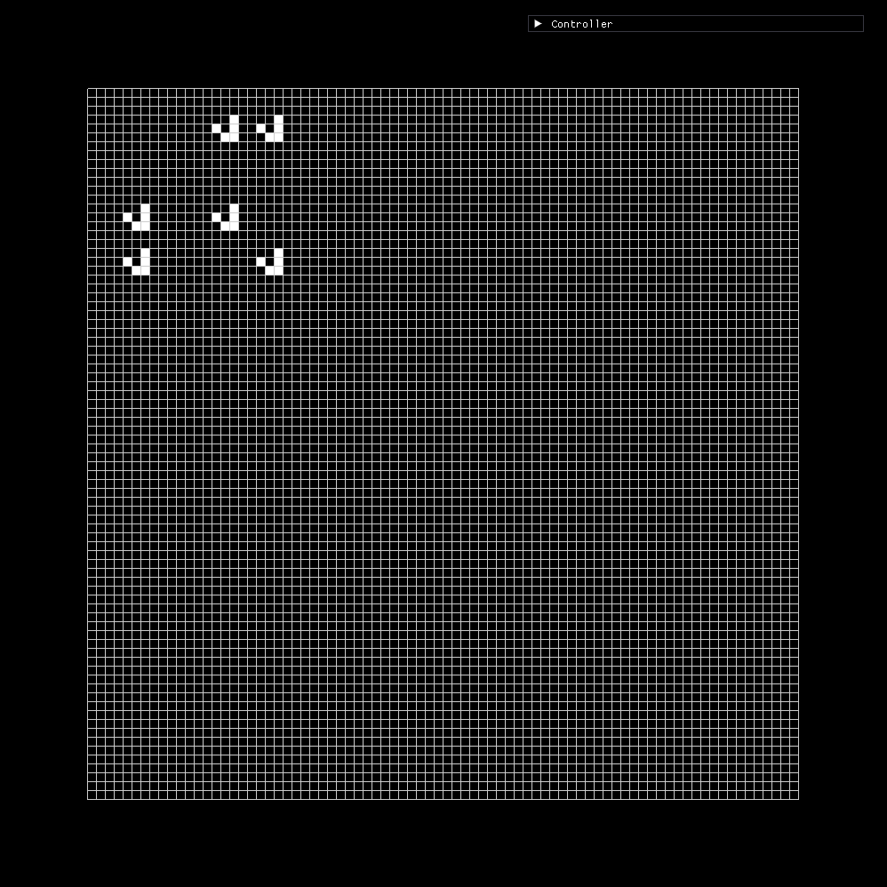
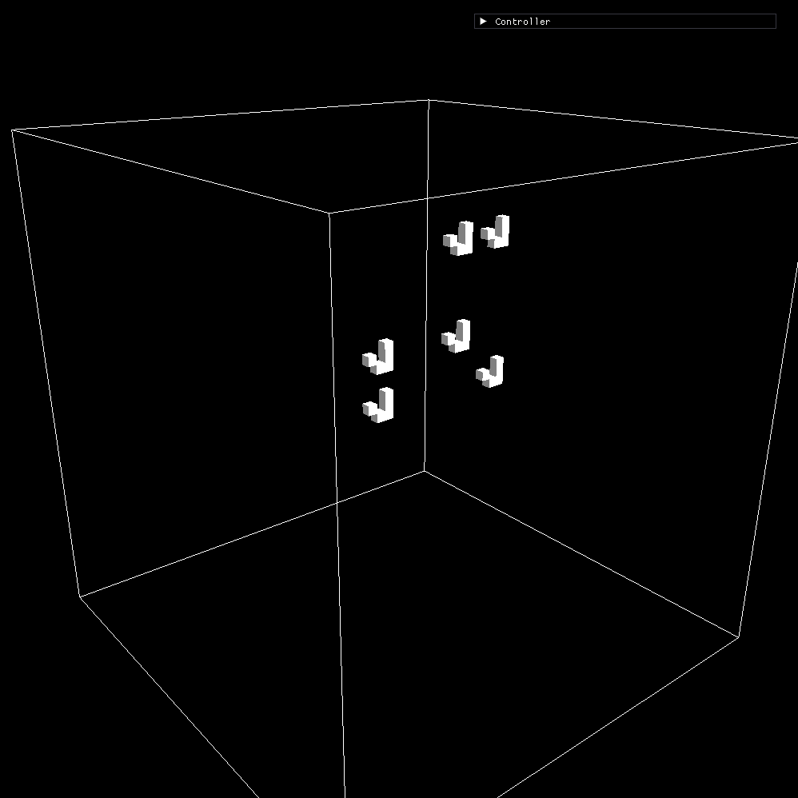
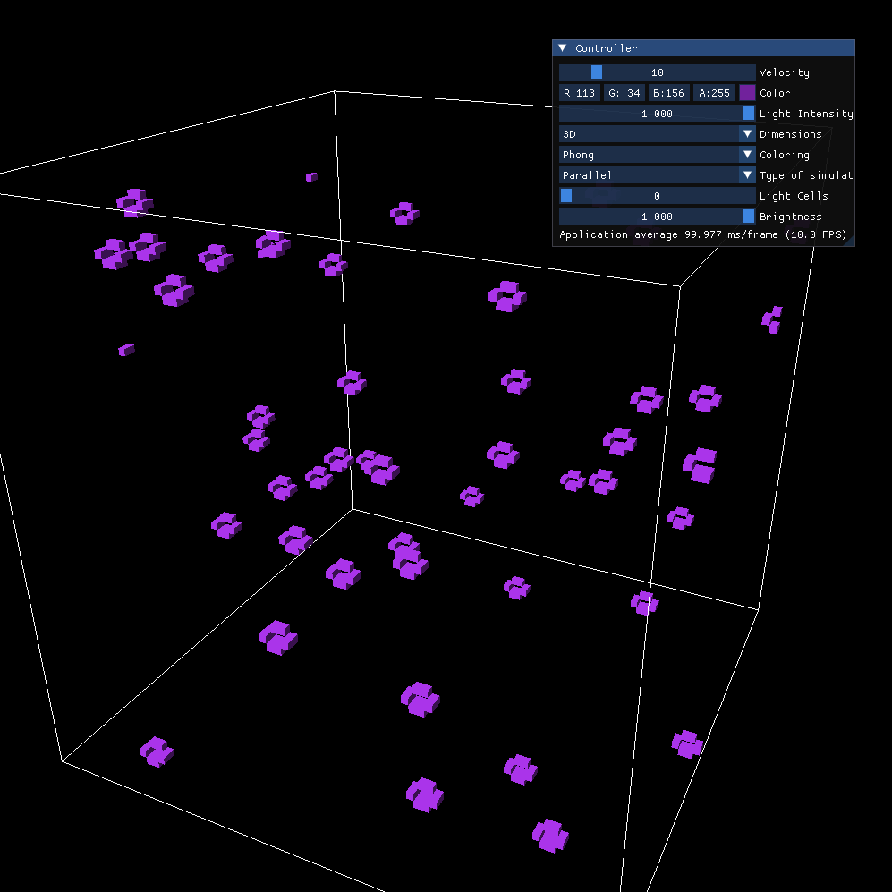
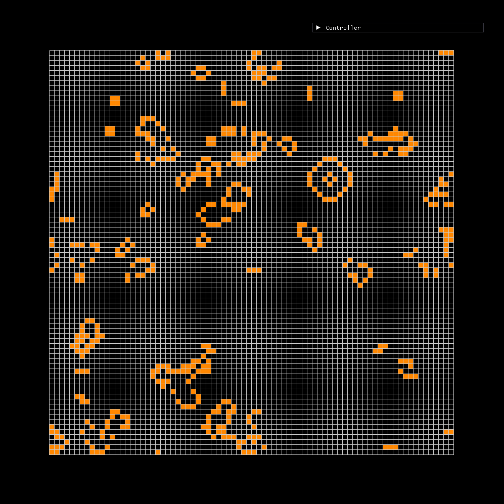
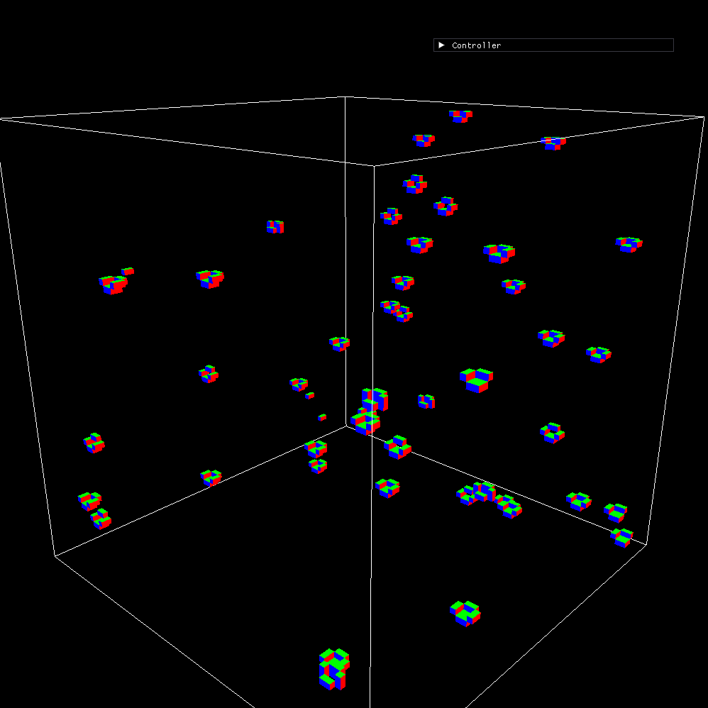
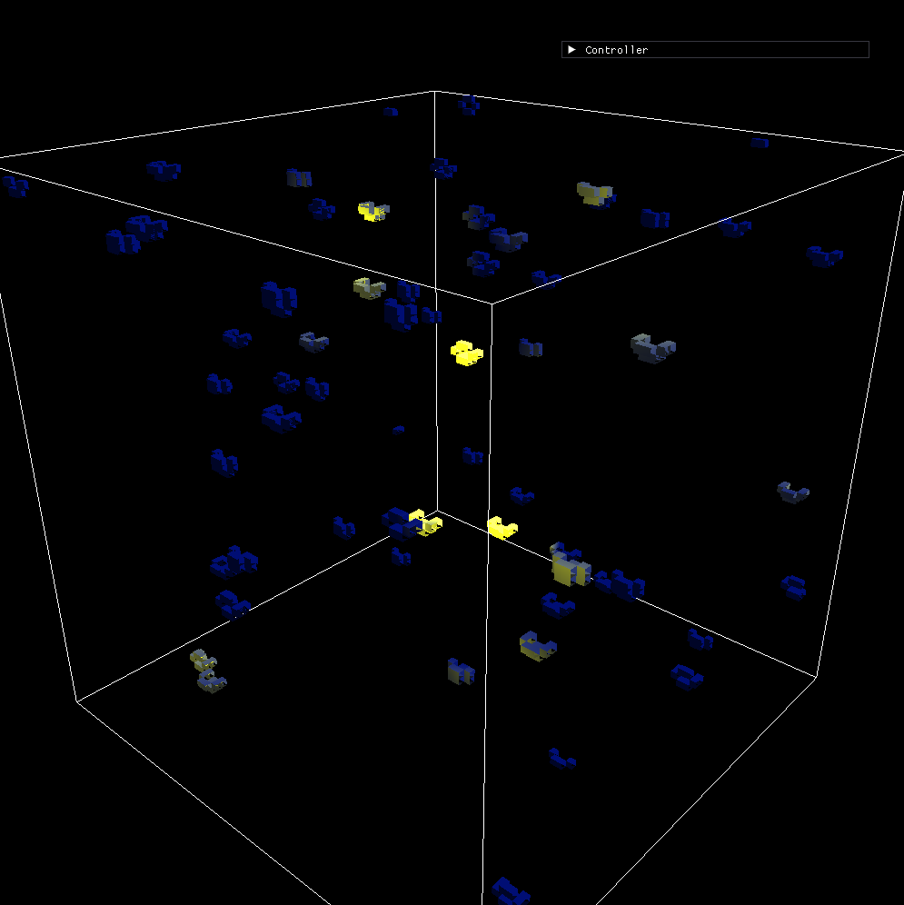

# Conway's Game of Life Visualizer
This project runs and visualizes a simulation of Conway's Game of Life. 

2D view            |  3D view
:-------------------------:|:-------------------------:
  |  

## Available Real-Time Configurations
These settings are managed by the Imgui window "Controller" and listed in the same order they appear.
- Velocity or FPS with a maximum of 60. This can also be controlled by up and down arrows.
- Color of cells.
- Intensity of directional light used when in 3D.
- Dimensions used for the simulation (2D or 3D). This setting affects the rules used for cell behavior as well as the lighting. This can also be controlled by left and right arrows.
- Type of coloring. This setting only affects the 3D simulations. Cells can be colored using the Phong model or Normals.
- Type of simulation changes the way the next step is calculated, between using a parallelized approach with OpenCL or a simple sequential pass through the whole world.
- Number of light cells. These are random cells that emit light.
- Brightness of lit cells.

### Other Key bidings
- `Space` plays and pauses the simulation.
- `M` generates 5 gliders on random positions.
- `K` empties the whole world, kills every cell.
- `WASD` rotates the camera around when in 3D.

## How to build
The following commands should build the project and generate a folder named `bin` which holds the binary `conway`.
```
mkdir build
cd build
cmake ..
make
```
To execute:
```
cd bin
./conway
```

## More Screenshots
|   | 
|:---:|:---:|
| Purple 3D gliders  | 2D view after generating several gliders

|  | 
|:---:|:---:|
| Normal coloring | Blue gliders iluminated by lit cells